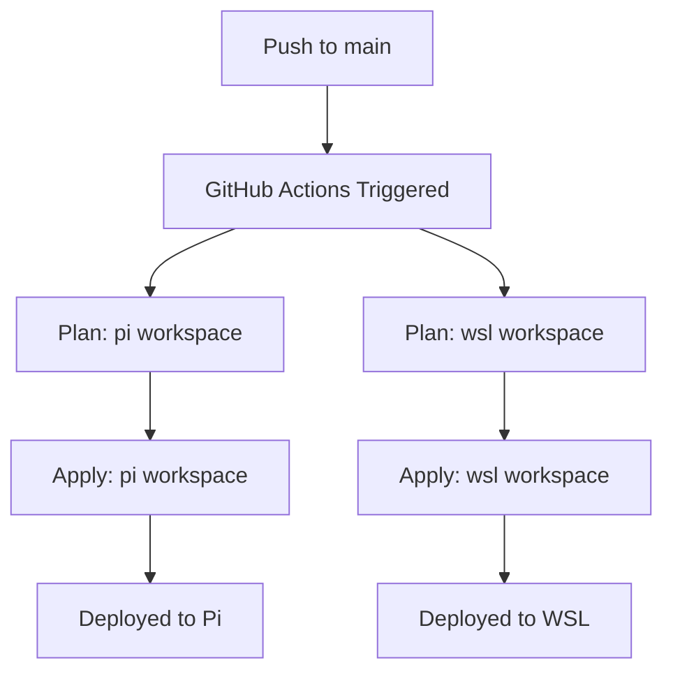

# Quick Start Guide - 5 Minutes to First Deployment

## Prerequisites Check

```bash
# 1. Check if you have GitHub CLI installed
gh --version

# 2. Check if authenticated
gh auth status

# 3. Check if MinIO/S3 backend is running
curl http://localhost:9000/minio/health/live

# 4. Check if Pi is reachable
ping -c 1 pi

# 5. Check if you can SSH to Pi
ssh naidu@pi "echo 'SSH works!'"
```

If any checks fail, see the troubleshooting section below.

## Step 1: Configure GitHub Secrets (2 minutes)

### Option A: Automated Script (Recommended)

```bash
cd /home/frontier/terraform/study_terraform
.github/setup-secrets.sh
```

Follow the prompts to set:
- AWS credentials (for MinIO backend)
- Pi SSH configuration

### Option B: Manual via GitHub CLI

```bash
# Set S3/MinIO credentials
echo "admin" | gh secret set AWS_ACCESS_KEY_ID
echo "password" | gh secret set AWS_SECRET_ACCESS_KEY

# Set Pi configuration
echo "pi" | gh secret set PI_HOST
cat ~/.ssh/id_rsa | gh secret set PI_SSH_PRIVATE_KEY
```

### Option C: Manual via GitHub Web UI

1. Go to: `https://github.com/YOUR_USERNAME/YOUR_REPO/settings/secrets/actions`
2. Click "New repository secret"
3. Add each secret:
   - `AWS_ACCESS_KEY_ID`: `admin`
   - `AWS_SECRET_ACCESS_KEY`: `password`
   - `PI_HOST`: `pi`
   - `PI_SSH_PRIVATE_KEY`: (paste your private key)

## Step 2: Push Pipeline to GitHub (1 minute)

```bash
cd /home/frontier/terraform/study_terraform

# Add the pipeline files
git add .github/

# Commit
git commit -m "Add GitHub Actions CI/CD pipeline for Terraform"

# Push to GitHub
git push origin main
```

## Step 3: Watch First Deployment (2 minutes)

### Via GitHub Web UI

1. Go to your repository on GitHub
2. Click **Actions** tab
3. You should see "Terraform Multi-Workspace Deployment" running
4. Click on it to watch progress

### Via GitHub CLI

```bash
# Watch the latest run
gh run watch

# Or list all runs
gh run list --workflow=terraform.yml
```

## Step 4: Verify Deployment

### Check Workflow Status

```bash
# View latest run
gh run view

# Check if it succeeded
gh run list --workflow=terraform.yml --limit 1
```

### Check Deployed Resources

**On WSL:**
```bash
docker ps --filter "label=managed_by=terraform"
docker network ls --filter "label=managed_by=terraform"
```

**On Pi:**
```bash
ssh naidu@pi "docker ps --filter 'label=managed_by=terraform'"
ssh naidu@pi "docker network ls --filter 'label=managed_by=terraform'"
```

## What Just Happened?



The pipeline:
1. ✅ Ran `terraform plan` for both workspaces
2. ✅ Applied changes to both workspaces sequentially
3. ✅ Deployed your Docker containers
4. ✅ Saved outputs as artifacts

## Next Steps

### Test Manual Deployment

1. Go to Actions tab
2. Click "Terraform Multi-Workspace Deployment"
3. Click "Run workflow"
4. Select:
   - Workspace: `wsl`
   - Action: `plan`
5. Click "Run workflow"

This will run a plan without applying changes.

### Test Pull Request Workflow

```bash
# Create a test branch
git checkout -b test/add-comment

# Make a small change
echo "# Test change" >> main.tf

# Commit and push
git add main.tf
git commit -m "Test: Add comment"
git push origin test/add-comment

# Create PR on GitHub
gh pr create --title "Test PR workflow" --body "Testing the pipeline"
```

The pipeline will:
- Run plan for both workspaces
- Comment the results on your PR
- NOT apply any changes

### Make Your First Infrastructure Change

```bash
# Edit your services configuration
vim terraform.tfvars

# Add a new service or modify existing one
# Example: Change nginx port

# Commit and push
git add terraform.tfvars
git commit -m "Update nginx configuration"
git push origin main
```

Watch it deploy automatically!

## Troubleshooting

### Issue: GitHub CLI Not Installed

```bash
# Ubuntu/Debian
sudo apt install gh

# macOS
brew install gh

# Then authenticate
gh auth login
```

### Issue: MinIO Not Running

```bash
# Start MinIO
docker run -d \
  -p 9000:9000 \
  -p 9001:9001 \
  --name minio \
  -v ~/minio/data:/data \
  minio/minio server /data --console-address ":9001"

# Create bucket
# Go to http://localhost:9001
# Login: admin / password
# Create bucket: tf-state
```

### Issue: Can't SSH to Pi

```bash
# Generate new SSH key
ssh-keygen -t rsa -b 4096 -f ~/.ssh/pi_terraform

# Copy to Pi
ssh-copy-id -i ~/.ssh/pi_terraform.pub naidu@pi

# Test
ssh -i ~/.ssh/pi_terraform naidu@pi "echo 'Works!'"

# Update GitHub secret
cat ~/.ssh/pi_terraform | gh secret set PI_SSH_PRIVATE_KEY
```

### Issue: Pipeline Fails on First Run

**Check the logs:**
```bash
gh run view --log
```

**Common causes:**
1. Secrets not set correctly → Re-run setup script
2. Backend not accessible → Check MinIO is running
3. Pi not reachable → Check network and SSH
4. Terraform syntax error → Run `terraform validate` locally

### Issue: State Lock Error

```bash
# Get the lock ID from error message
# Then force unlock (be careful!)
terraform force-unlock <LOCK_ID>
```

## Quick Reference Commands

```bash
# View workflow runs
gh run list --workflow=terraform.yml

# Watch latest run
gh run watch

# View specific run
gh run view <run-id>

# Download artifacts
gh run download <run-id>

# List secrets
gh secret list

# Set a secret
gh secret set SECRET_NAME

# Trigger manual run (plan only)
gh workflow run terraform.yml \
  -f workspace=both \
  -f action=plan

# View workflow file
cat .github/workflows/terraform.yml
```

## Configuration Files Reference

```
study_terraform/
├── .github/
│   ├── workflows/
│   │   └── terraform.yml          # Main pipeline
│   ├── README.md                  # Full documentation
│   ├── QUICKSTART.md             # This file
│   ├── MANUAL_DEPLOYMENT.md      # Manual deployment guide
│   ├── PIPELINE_SUMMARY.md       # Architecture summary
│   └── setup-secrets.sh          # Secrets setup script
├── main.tf                       # Infrastructure code
├── backend.tf                    # S3/MinIO backend
├── provider.tf                   # Docker provider
├── variables.tf                  # Variable definitions
├── locals.tf                     # Workspace logic
├── pi.tfvars                     # Pi configuration
└── wsl.tfvars                    # WSL configuration
```

## Success Indicators

You'll know everything is working when:

✅ Secrets are configured (check: `gh secret list`)
✅ First push triggers workflow (check: Actions tab)
✅ Both workspaces plan successfully
✅ Both workspaces apply successfully
✅ Resources are deployed (check: `docker ps`)
✅ Artifacts are uploaded (check: workflow run page)

## Getting Help

1. **Check logs**: `gh run view --log`
2. **Read documentation**: `.github/workflows/README.md`
3. **Manual deployment guide**: `.github/MANUAL_DEPLOYMENT.md`
4. **Test locally**: Run terraform commands on your machine

## Summary

You've just set up a production-ready CI/CD pipeline! 🎉

**What you can do now:**
- ✅ Push to main → automatic deployment
- ✅ Create PR → see plan comments
- ✅ Manual deployment → target specific workspaces
- ✅ Safe destruction → remove infrastructure when needed

**Time to first deployment:** ~5 minutes
**Maintenance required:** Minimal (just push your changes!)

Happy deploying! 🚀
